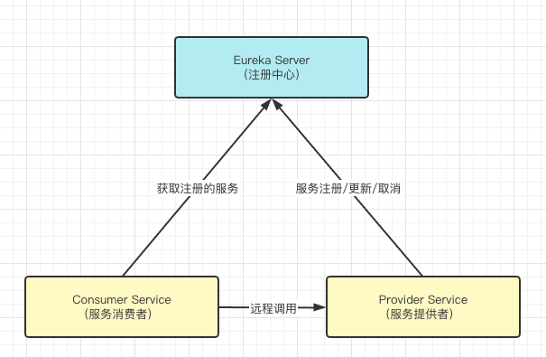
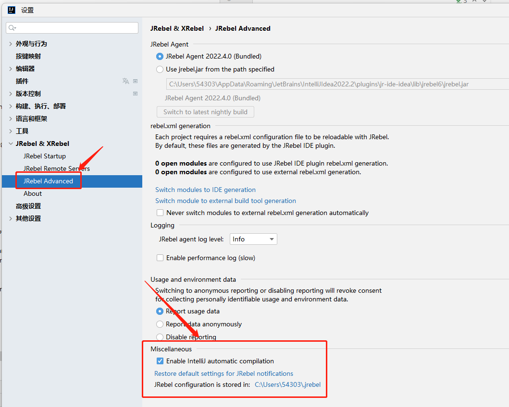
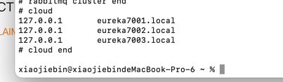
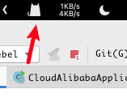
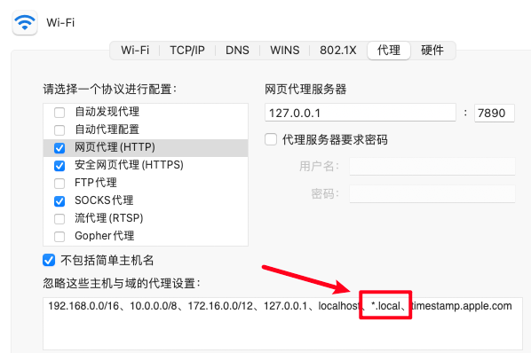

# SpringCloud笔记

1. 服务注册中心
    - <font color='red'>Eureka 停止维护</font>
    - Zookeeper 可用
    - Consul 可用
    - <font color='green'>Nacos 推荐</font>

2. 服务调用
    - Ribbon 可用
    - LoadBalancer 可用
    - <font color='red'>Feign 停止维护</font>
    - <font color='GREEN'>OpenFeign 推荐</font>

3. 服务降级
    - <font color='red'>Hystrix 停止维护</font>
    - resilience4j(国外使用)
    - <font color='green'>sentinel 推荐</font>
4. 服务网关
    - <font color='red'>Zuul 停止维护</font>
    - <font color='PINK'>Zuul2 不推荐</font>
    - <font color='green'>getaway 推荐</font>
5. 服务配置
    - <font color='red'>Config 停止维护</font>
    - <font color='green'>Nacos</font>
6. 服务总线
    - <font color='pink'>Bus不推荐</font>
    - <font color='green'>Nacos</font>

# Eureka注册中心



- 使用Eureka Client链接到Eureka Server上并保持心跳
- 服务消费这通过Eureka Server获取注册的服务信息,然后通过相关信息,然后进行远程调用
- Eureka Server 集群部署保证高可用行

## Eureka Server

EurekaServer中的服务注册表中将会存储所有可用服务节点的信息。

## Eureka Client

- 内置负载均衡,使用轮询的方式进行服务调用
- 启动后默认每三十秒向Eureka Server发送心跳，如果Eureka Server在多个周期中没有收到心跳，则表示该服务离线，并将其移除，默认时间是90秒

## Eureka Cluster（集群）

- 多个Eureka Server相互注册组建一个集群，对外暴露一个服务注册接口
- 实现负载均衡
- 实现故障容错，保证某些注册中心宕机的情况下，服务仍然可以调用。

## 服务集群 CAP

Eureka属于 AP，一致性和分区容错性

## Eureka保护机制

- 一定时间内Eureka Server没有接收到某个微服务的心跳，Eureka Server将会注销实例（默认是90秒）
- 当某个服务正常，但是网络发生故障（导致延时、卡顿、拥挤）时，这个实例无法和Eureka Server正常通信，则会进入"自我保护机制"

## Zookeeper注册中心

1. 配置好zookeeper，启动

2. 创建相关的SpringBoot服务，导入对应的包

3. 配置YAML文件

    1. ```yaml
        server:
        port: 80
        spring:
        application:
          name: cloud-zk-consumer-order
        cloud:
          zookeeper:
            # 注册中心地址
            connect-string: 127.0.0.1:2181
            # 会话超时时间
            session-timeout: 5000
            # 链接超时时间
            connection-timeout: 5000
            # 最大重试次数
            max-retries: 5
      ```

4. 启动服务即可

## Consul注册中心

1. 下载consul服务端，并启动

    1. ```sh
        consul agent -dev
      ```

2. 创建springboot服务导入对应的consul client包

3. 配置YAML文件

   ```yaml
   server:
     port: 80
   
   spring:
     application:
       name: consul-consumer-order
     cloud:
       consul:
         host: 127.0.0.1
         port: 8500
         discovery:
           #是否注册
           register: true
           #健康检查路径
           health-check-path: /actuator/health
           #健康检查时间间隔
           health-check-interval: 15s
           #开启IP地址注册
           prefer-ip-address: true
   
   ```

# 负载均衡

spring-cloud-netflix会默认自动轮询的负载均衡

## Ribbon
ribbon在cloud-netflix-2021版本中已经弃用，导入后不能够正确的找到服务，无法使用
- RoundRibbonRule 线性轮询策略
- RetryRule 重试策略
- WeightedResponseTimeRule 加权响应时间策略
- RandomRule 随机策略
- ClientConfigEnabledRoundRobbinRule 客户端配置启动线性轮询策略
- BestAvailableRule 最空闲策略
- PredicateBasedRule 过滤线性轮询策略
- ZoneAvoidanceRule 区域感知论序策略
- AvailabilityFilteringRule 可用性过滤策略
## loadBalancer

### 负载模式
- RandomLoadBalancer 随机策略
- RoundRobinLoadBalancer 轮询策略

LoadBalancer只提供了两种负载策略，其他的由开发这通过实现ReactorServiceInstanceLoadBalancer接口在定义负载规则

### 配置问题
```java
@LoadBalancerClient(name = "PROVIDER-PAYMENT-SERVICE", configuration = CustomRandomLoadBalancer.class)
```
> name是服务提供者在注册中心的统一名字，configuration指定负载规则

# HyStrix

## 服务降级

> 注意：2021后的Hytrix开启openfeign服务降级
>
> 
>
> 当服务出现以下情况后，返回友好提示，保证调用方不会长时间的等待或者抛出异常。

- 服务降级一般放在客户端

- @HystrixProperty参数配置

  - ```java
    hystrix.command.default和hystrix.threadpool.default中的default为默认CommandKey
    
    Command Properties
    Execution相关的属性的配置：
    hystrix.command.default.execution.isolation.strategy 隔离策略，默认是Thread, 可选Thread｜Semaphore
    
    hystrix.command.default.execution.isolation.thread.timeoutInMilliseconds 命令执行超时时间，默认1000ms
    
    hystrix.command.default.execution.timeout.enabled 执行是否启用超时，默认启用true
    hystrix.command.default.execution.isolation.thread.interruptOnTimeout 发生超时是是否中断，默认true
    hystrix.command.default.execution.isolation.semaphore.maxConcurrentRequests 最大并发请求数，默认10，该参数当使用ExecutionIsolationStrategy.SEMAPHORE策略时才有效。如果达到最大并发请求数，请求会被拒绝。理论上选择semaphore size的原则和选择thread size一致，但选用semaphore时每次执行的单元要比较小且执行速度快（ms级别），否则的话应该用thread。
    semaphore应该占整个容器（tomcat）的线程池的一小部分。
    Fallback相关的属性
    这些参数可以应用于Hystrix的THREAD和SEMAPHORE策略
    
    hystrix.command.default.fallback.isolation.semaphore.maxConcurrentRequests 如果并发数达到该设置值，请求会被拒绝和抛出异常并且fallback不会被调用。默认10
    hystrix.command.default.fallback.enabled 当执行失败或者请求被拒绝，是否会尝试调用hystrixCommand.getFallback() 。默认true
    Circuit Breaker相关的属性
    hystrix.command.default.circuitBreaker.enabled 用来跟踪circuit的健康性，如果未达标则让request短路。默认true
    hystrix.command.default.circuitBreaker.requestVolumeThreshold 一个rolling window内最小的请求数。如果设为20，那么当一个rolling window的时间内（比如说1个rolling window是10秒）收到19个请求，即使19个请求都失败，也不会触发circuit break。默认20
    hystrix.command.default.circuitBreaker.sleepWindowInMilliseconds 触发短路的时间值，当该值设为5000时，则当触发circuit break后的5000毫秒内都会拒绝request，也就是5000毫秒后才会关闭circuit。默认5000
    hystrix.command.default.circuitBreaker.errorThresholdPercentage错误比率阀值，如果错误率>=该值，circuit会被打开，并短路所有请求触发fallback。默认50
    hystrix.command.default.circuitBreaker.forceOpen 强制打开熔断器，如果打开这个开关，那么拒绝所有request，默认false
    hystrix.command.default.circuitBreaker.forceClosed 强制关闭熔断器 如果这个开关打开，circuit将一直关闭且忽略circuitBreaker.errorThresholdPercentage
    Metrics相关参数
    hystrix.command.default.metrics.rollingStats.timeInMilliseconds 设置统计的时间窗口值的，毫秒值，circuit break 的打开会根据1个rolling window的统计来计算。若rolling window被设为10000毫秒，则rolling window会被分成n个buckets，每个bucket包含success，failure，timeout，rejection的次数的统计信息。默认10000
    hystrix.command.default.metrics.rollingStats.numBuckets 设置一个rolling window被划分的数量，若numBuckets＝10，rolling window＝10000，那么一个bucket的时间即1秒。必须符合rolling window % numberBuckets == 0。默认10
    hystrix.command.default.metrics.rollingPercentile.enabled 执行时是否enable指标的计算和跟踪，默认true
    hystrix.command.default.metrics.rollingPercentile.timeInMilliseconds 设置rolling percentile window的时间，默认60000
    hystrix.command.default.metrics.rollingPercentile.numBuckets 设置rolling percentile window的numberBuckets。逻辑同上。默认6
    hystrix.command.default.metrics.rollingPercentile.bucketSize 如果bucket size＝100，window＝10s，若这10s里有500次执行，只有最后100次执行会被统计到bucket里去。增加该值会增加内存开销以及排序的开销。默认100
    hystrix.command.default.metrics.healthSnapshot.intervalInMilliseconds 记录health 快照（用来统计成功和错误绿）的间隔，默认500ms
    Request Context 相关参数
    hystrix.command.default.requestCache.enabled 默认true，需要重载getCacheKey()，返回null时不缓存
    hystrix.command.default.requestLog.enabled 记录日志到HystrixRequestLog，默认true
    
    Collapser Properties 相关参数
    hystrix.collapser.default.maxRequestsInBatch 单次批处理的最大请求数，达到该数量触发批处理，默认Integer.MAX_VALUE
    hystrix.collapser.default.timerDelayInMilliseconds 触发批处理的延迟，也可以为创建批处理的时间＋该值，默认10
    hystrix.collapser.default.requestCache.enabled 是否对HystrixCollapser.execute() and HystrixCollapser.queue()的cache，默认true
    
    ThreadPool 相关参数
    线程数默认值10适用于大部分情况（有时可以设置得更小），如果需要设置得更大，那有个基本得公式可以follow：
    requests per second at peak when healthy × 99th percentile latency in seconds + some breathing room
    每秒最大支撑的请求数 (99%平均响应时间 + 缓存值)
    比如：每秒能处理1000个请求，99%的请求响应时间是60ms，那么公式是：
    （0.060+0.012）
    
    基本得原则时保持线程池尽可能小，他主要是为了释放压力，防止资源被阻塞。
    当一切都是正常的时候，线程池一般仅会有1到2个线程激活来提供服务
    
    hystrix.threadpool.default.coreSize 并发执行的最大线程数，默认10
    hystrix.threadpool.default.maxQueueSize BlockingQueue的最大队列数，当设为－1，会使用SynchronousQueue，值为正时使用LinkedBlcokingQueue。该设置只会在初始化时有效，之后不能修改threadpool的queue size，除非reinitialising thread executor。默认－1。
    hystrix.threadpool.default.queueSizeRejectionThreshold 即使maxQueueSize没有达到，达到queueSizeRejectionThreshold该值后，请求也会被拒绝。因为maxQueueSize不能被动态修改，这个参数将允许我们动态设置该值。if maxQueueSize == -1，该字段将不起作用
    hystrix.threadpool.default.keepAliveTimeMinutes 如果corePoolSize和maxPoolSize设成一样（默认实现）该设置无效。如果通过plugin（https://github.com/Netflix/Hystrix/wiki/Plugins）使用自定义实现，该设置才有用，默认1.
    hystrix.threadpool.default.metrics.rollingStats.timeInMilliseconds 线程池统计指标的时间，默认10000
    hystrix.threadpool.default.metrics.rollingStats.numBuckets 将rolling window划分为n个buckets，默认10
    
    ```

    

需要降级处理的情况：

- 程序运行异常
- 请求超时
- 服务熔断出发服务降级
- 线程池/信号量打满也会导致服务降级

## 服务熔断

> 服务达到最大访问后，拒绝请求，并返回友好提示。防止突然大量的并发请求导致服务奔溃
>
> 属于兜底策略，服务降级->服务熔断->恢复调用链路

## 服务限流

> 按照指定的规则进行请求处理，比如：每秒只能处理多少个请求


# 遇到的问题

## 1. 统一返回时，出现空JSON，没有设置GET/SET方法导致

## 2. JRebel不自动加载的问题



## 3. 关于maven编译时总是切换编译的JDK版本的问题,在maven中添加编译版本和编译后目标版本即可解决

```xml

<profile>
    <id>JDK1.8</id>
    <activation>
        <activeByDefault>true</activeByDefault>
    </activation>
    <properties>
        <maven.compiler.source>1.8</maven.compiler.source>
        <maven.compiler.target>1.8</maven.compiler.target>
        <encoding>UTF-8</encoding>
    </properties>
</profile>
```

## 关于Mac配置hosts域名代理后，通过域名无法访问的问题



导致原因：开启了系统代理（比如VPN）



解决办法：在网络偏好设置中放行此域名

