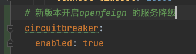
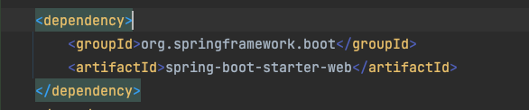

# SpringCloud笔记

1. 服务注册中心
    - <font color='red'>Eureka 停止维护</font>
    - Zookeeper 可用
    - Consul 可用
    - <font color='green'>Nacos 推荐</font>

2. 服务调用
    - Ribbon 可用
    - LoadBalancer 可用
    - <font color='red'>Feign 停止维护</font>
    - <font color='GREEN'>OpenFeign 推荐</font>

3. 服务降级
    - <font color='red'>Hystrix 停止维护</font>
    - resilience4j(国外使用)
    - <font color='green'>sentinel 推荐</font>
4. 服务网关
    - <font color='red'>Zuul 停止维护</font>
    - <font color='PINK'>Zuul2 不推荐</font>
    - <font color='green'>getaway 推荐</font>
5. 服务配置
    - <font color='red'>Config 停止维护</font>
    - <font color='green'>Nacos</font>
6. 服务总线
    - <font color='pink'>Bus不推荐</font>
    - <font color='green'>Nacos</font>

# Eureka注册中心


- 使用Eureka Client链接到Eureka Server上并保持心跳
- 服务消费这通过Eureka Server获取注册的服务信息,然后通过相关信息,然后进行远程调用
- Eureka Server 集群部署保证高可用行

## Eureka Server

EurekaServer中的服务注册表中将会存储所有可用服务节点的信息。

## Eureka Client

- 内置负载均衡,使用轮询的方式进行服务调用
- 启动后默认每三十秒向Eureka Server发送心跳，如果Eureka Server在多个周期中没有收到心跳，则表示该服务离线，并将其移除，默认时间是90秒

## Eureka Cluster（集群）

- 多个Eureka Server相互注册组建一个集群，对外暴露一个服务注册接口
- 实现负载均衡
- 实现故障容错，保证某些注册中心宕机的情况下，服务仍然可以调用。

## 服务集群 CAP

Eureka属于 AP，一致性和分区容错性

## Eureka保护机制

- 一定时间内Eureka Server没有接收到某个微服务的心跳，Eureka Server将会注销实例（默认是90秒）
- 当某个服务正常，但是网络发生故障（导致延时、卡顿、拥挤）时，这个实例无法和Eureka Server正常通信，则会进入"自我保护机制"

## Zookeeper注册中心

1. 配置好zookeeper，启动

2. 创建相关的SpringBoot服务，导入对应的包

3. 配置YAML文件

    1. ```yaml
        server:
        port: 80
        spring:
        application:
          name: cloud-zk-consumer-order
        cloud:
          zookeeper:
            # 注册中心地址
            connect-string: 127.0.0.1:2181
            # 会话超时时间
            session-timeout: 5000
            # 链接超时时间
            connection-timeout: 5000
            # 最大重试次数
            max-retries: 5
      ```

4. 启动服务即可

## Consul注册中心

1. 下载consul服务端，并启动

    1. ```sh
        consul agent -dev
      ```

2. 创建springboot服务导入对应的consul client包

3. 配置YAML文件

   ```yaml
   server:
     port: 80
   
   spring:
     application:
       name: consul-consumer-order
     cloud:
       consul:
         host: 127.0.0.1
         port: 8500
         discovery:
           #是否注册
           register: true
           #健康检查路径
           health-check-path: /actuator/health
           #健康检查时间间隔
           health-check-interval: 15s
           #开启IP地址注册
           prefer-ip-address: true
   
   ```

# 负载均衡

spring-cloud-netflix会默认自动轮询的负载均衡

## Ribbon

ribbon在cloud-netflix-2021版本中已经弃用，导入后不能够正确的找到服务，无法使用

- RoundRibbonRule 线性轮询策略
- RetryRule 重试策略
- WeightedResponseTimeRule 加权响应时间策略
- RandomRule 随机策略
- ClientConfigEnabledRoundRobbinRule 客户端配置启动线性轮询策略
- BestAvailableRule 最空闲策略
- PredicateBasedRule 过滤线性轮询策略
- ZoneAvoidanceRule 区域感知论序策略
- AvailabilityFilteringRule 可用性过滤策略

## loadBalancer

### 负载模式

- RandomLoadBalancer 随机策略
- RoundRobinLoadBalancer 轮询策略

LoadBalancer只提供了两种负载策略，其他的由开发这通过实现ReactorServiceInstanceLoadBalancer接口在定义负载规则

### 配置问题

```java
@LoadBalancerClient(name = "PROVIDER-PAYMENT-SERVICE", configuration = CustomRandomLoadBalancer.class)
```

> name是服务提供者在注册中心的统一名字，configuration指定负载规则

# HyStrix

## 服务降级

> 注意：2021后的Hytrix开启openfeign服务降级
>
> 
>
> 当服务出现以下情况后，返回友好提示，保证调用方不会长时间的等待或者抛出异常。

- 服务降级一般放在客户端

- @HystrixProperty参数配置

    - ```java
    @HystrixCommand(fallbackMethod = "fallbackMethod", 
                    groupKey = "strGroupCommand", 
                    commandKey = "strCommand", 
                    threadPoolKey = "strThreadPool",
                    
                    commandProperties = {
                        // 设置隔离策略，THREAD 表示线程池 SEMAPHORE：信号池隔离
                        @HystrixProperty(name = "execution.isolation.strategy", value = "THREAD"),
                        // 当隔离策略选择信号池隔离的时候，用来设置信号池的大小（最大并发数）
                        @HystrixProperty(name = "execution.isolation.semaphore.maxConcurrentRequests", value = "10"),
                        // 配置命令执行的超时时间
                        @HystrixProperty(name = "execution.isolation.thread.timeoutinMilliseconds", value = "10"),
                        // 是否启用超时时间
                        @HystrixProperty(name = "execution.timeout.enabled", value = "true"),
                        // 执行超时的时候是否中断
                        @HystrixProperty(name = "execution.isolation.thread.interruptOnTimeout", value = "true"),
                        
                        // 执行被取消的时候是否中断
                        @HystrixProperty(name = "execution.isolation.thread.interruptOnCancel", value = "true"),
                        // 允许回调方法执行的最大并发数
                        @HystrixProperty(name = "fallback.isolation.semaphore.maxConcurrentRequests", value = "10"),
                        // 服务降级是否启用，是否执行回调函数
                        @HystrixProperty(name = "fallback.enabled", value = "true"),
                        // 是否启用断路器
                        @HystrixProperty(name = "circuitBreaker.enabled", value = "true"),
                        // 该属性用来设置在滚动时间窗中，断路器熔断的最小请求数。例如，默认该值为 20 的时候，如果滚动时间窗（默认10秒）内仅收到了19个请求， 即使这19个请求都失败了，断路器也不会打开。
                        @HystrixProperty(name = "circuitBreaker.requestVolumeThreshold", value = "20"),
                        
                        // 该属性用来设置在滚动时间窗中，表示在滚动时间窗中，在请求数量超过 circuitBreaker.requestVolumeThreshold 的情况下，如果错误请求数的百分比超过50, 就把断路器设置为 "打开" 状态，否则就设置为 "关闭" 状态。
                        @HystrixProperty(name = "circuitBreaker.errorThresholdPercentage", value = "50"),
                        // 该属性用来设置当断路器打开之后的休眠时间窗。 休眠时间窗结束之后，会将断路器置为 "半开" 状态，尝试熔断的请求命令，如果依然失败就将断路器继续设置为 "打开" 状态，如果成功就设置为 "关闭" 状态。
                        @HystrixProperty(name = "circuitBreaker.sleepWindowinMilliseconds", value = "5000"),
                        // 断路器强制打开
                        @HystrixProperty(name = "circuitBreaker.forceOpen", value = "false"),
                        // 断路器强制关闭
                        @HystrixProperty(name = "circuitBreaker.forceClosed", value = "false"),
                        // 滚动时间窗设置，该时间用于断路器判断健康度时需要收集信息的持续时间
                        @HystrixProperty(name = "metrics.rollingStats.timeinMilliseconds", value = "10000"),
                        
                        // 该属性用来设置滚动时间窗统计指标信息时划分"桶"的数量，断路器在收集指标信息的时候会根据设置的时间窗长度拆分成多个 "桶" 来累计各度量值，每个"桶"记录了一段时间内的采集指标。
                        // 比如 10 秒内拆分成 10 个"桶"收集这样，所以 timeinMilliseconds 必须能被 numBuckets 整除。否则会抛异常
                        @HystrixProperty(name = "metrics.rollingStats.numBuckets", value = "10"),
                        // 该属性用来设置对命令执行的延迟是否使用百分位数来跟踪和计算。如果设置为 false, 那么所有的概要统计都将返回 -1。
                        @HystrixProperty(name = "metrics.rollingPercentile.enabled", value = "false"),
                        // 该属性用来设置百分位统计的滚动窗口的持续时间，单位为毫秒。
                        @HystrixProperty(name = "metrics.rollingPercentile.timeInMilliseconds", value = "60000"),
                        // 该属性用来设置百分位统计滚动窗口中使用 “ 桶 ”的数量。
                        @HystrixProperty(name = "metrics.rollingPercentile.numBuckets", value = "60000"),
                        // 该属性用来设置在执行过程中每个 “桶” 中保留的最大执行次数。如果在滚动时间窗内发生超过该设定值的执行次数，
                        // 就从最初的位置开始重写。例如，将该值设置为100, 滚动窗口为10秒，若在10秒内一个 “桶 ”中发生了500次执行，
                        // 那么该 “桶” 中只保留 最后的100次执行的统计。另外，增加该值的大小将会增加内存量的消耗，并增加排序百分位数所需的计算时间。
                        @HystrixProperty(name = "metrics.rollingPercentile.bucketSize", value = "100"),
                        
                        // 该属性用来设置采集影响断路器状态的健康快照（请求的成功、 错误百分比）的间隔等待时间。
                        @HystrixProperty(name = "metrics.healthSnapshot.intervalinMilliseconds", value = "500"),
                        // 是否开启请求缓存
                        @HystrixProperty(name = "requestCache.enabled", value = "true"),
                        // HystrixCommand的执行和事件是否打印日志到 HystrixRequestLog 中
                        @HystrixProperty(name = "requestLog.enabled", value = "true"),
    
                    },
                    threadPoolProperties = {
                        // 该参数用来设置执行命令线程池的核心线程数，该值也就是命令执行的最大并发量
                        @HystrixProperty(name = "coreSize", value = "10"),
                        // 该参数用来设置线程池的最大队列大小。当设置为 -1 时，线程池将使用 SynchronousQueue 实现的队列，否则将使用 LinkedBlockingQueue 实现的队列。
                        @HystrixProperty(name = "maxQueueSize", value = "-1"),
                        // 该参数用来为队列设置拒绝阈值。 通过该参数， 即使队列没有达到最大值也能拒绝请求。
                        // 该参数主要是对 LinkedBlockingQueue 队列的补充,因为 LinkedBlockingQueue 队列不能动态修改它的对象大小，而通过该属性就可以调整拒绝请求的队列大小了。
                        @HystrixProperty(name = "queueSizeRejectionThreshold", value = "5"),
                    }
                   )
    public String doSomething() {
    	...
    }
    
    ```

需要降级处理的情况：

- 程序运行异常
- 请求超时
- 服务熔断出发服务降级
- 线程池/信号量打满也会导致服务降级

## 服务熔断

> 服务达到最大访问后、或者请求发生错误、拒绝请求，并返回友好提示。防止突然大量的并发请求导致服务奔溃
>
> 属于兜底策略，服务降级->服务熔断->恢复调用链路

熔断类型：

- 熔断打开：请求不在进行调用当前服务，内部设置时钟一般为MTTR（平均故障处理时间），当打开时长达到所设始终则进入半熔断状态。
- 熔断关闭：熔断关闭不会对服务进行熔断
- 熔断半开：部分请求更具规则调用当前服务，如果请求成功且符合规则则认为当前服务恢复正常，关闭熔断

> 1. 快照时间窗口：断路器确定是否打开需要统计一些请求和错误信息，二统计的时间范围就是快照时间窗口，默认为最近十秒
>
> 2. 请求总数逾制：在快照时间窗内，必须满足请求总数逾制才有资格熔断。默认20，意味着在10秒内，如果hystrix命令的调用次数不足20次，即使所有的请求都超时或其他原因失败，断路器都不会打开
>
> 3. 错误百分比阈值：当请求总数在快照时间窗口内超过了与之，如果发生了30次调用，如果在30次调用中，有15次发生了异常，也就是超过50%的错误百分比，在默认设定50%与之情况下，这时候就会将断路器打开。

## 服务限流

> 按照指定的规则进行请求处理，比如：每秒只能处理多少个请求

# Gateway

## 核心概念

- Route（路由）：路由是构建网管的基本模块，由ID，目标URI，一系列的断言和过滤器组成，如果断言为true则匹配该路由

- Predicate（断言）：开发人员可以匹配HTTP请求中的所有内容（例如请求头或请求参数），如果请求与断言相匹配则进行路由

- Filter（过滤）：指的是spring框架中GatewayFilter的实力，使用过滤器，可以在请求被路由或者之后对请求进行修改

# 遇到的问题

## 1. 统一返回时，出现空JSON，没有设置GET/SET方法导致

## 2. JRebel不自动加载的问题


## 3. 关于maven编译时总是切换编译的JDK版本的问题,在maven中添加编译版本和编译后目标版本即可解决

```xml

<profile>
    <id>JDK1.8</id>
    <activation>
        <activeByDefault>true</activeByDefault>
    </activation>
    <properties>
        <maven.compiler.source>1.8</maven.compiler.source>
        <maven.compiler.target>1.8</maven.compiler.target>
        <encoding>UTF-8</encoding>
    </properties>
</profile>
```

## 关于Mac配置hosts域名代理后，通过域名无法访问的问题


导致原因：开启了系统代理（比如VPN）


解决办法：在网络偏好设置中放行此域名


## 傻子问题：启动后直接停止服务

导致原因：没有添加spring-boot-starter-web包
解决办法：添加web包
